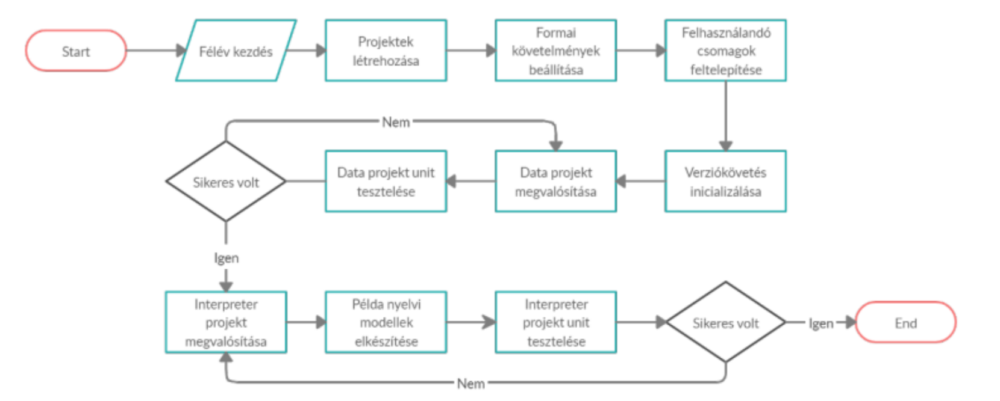

.\
.

### Figyelem! Jelen útmutató illetve követelményleírás csak Sipos Miklós szakdolgozói számára vonatkozik.

Más oktatóknál a pontos elvárások, határidők valamint egyéb részletek eltérhetnek!

.\
.

# Tartalomjegyzék
- Szakdolgozat I. útmutató: [link](https://github.com/siposm/oktatas-szakd-docs/blob/master/SZAKD1.md)
- Szakdolgozat II. útmutató: [link](https://github.com/siposm/oktatas-szakd-docs/blob/master/SZAKD2.md)
- Szakdolgozat I. és II. prezentáció / védés útmutató: [link](https://github.com/siposm/oktatas-szakd-docs/blob/master/presentation.md)
- Szakdolgozat feladatkiírási minták: [link](https://github.com/siposm/oktatas-szakd-docs/blob/master/szakd_feladatkiiras_sablon.md)
- Szakdolgozók GitHub csoportja: [link](https://github.com/szakdolgozok-siposm)

# Szakdolgozat I. Tájékoztató

Jelen dokumentum keretein belül szeretném összefoglalni a `Szakdolgozat I. tárgy menetrendjét, követelményeit és elvárásait`. Kérnék mindenkit, hogy figyelmesen olvassa át és a félévben az itt leírtaknak megfelelően járjon el.

## Félévi mérföldkövek
  - **MK 1.:** 04. hét » hasonló rendszerek elemzése és bemutatása
  - **MK 2.:** 08. hét » kapcsolódó témakörök irodalomkutatása / feldolgozása
  - **MK 3.:** 10. hét » irodalomkutatás összegzése
  - **MK 4.:** 13. hét » tervezés + követelmény specifikáció

Adott hét `vasárnapjának 23:59 percéig` szeretném Teams privát üzenet formájában megkapni a szakdoga aktuális (és az előzőhöz képest előrehaladottabb) változatát. Az üzenetben vázlatpontokban szívesen venném, ha fel lenne tüntetve, hogy mi került bele pluszként az előzőhöz képest. Ha a doksiban esetleg sárga háttérrel megjelölitek az is teljesen rendben van. A lényeg az lenne, hogy átnézve könnyen lássam egyből mi az inkrementum.

Küldéskor pdf verziót küldjetek.\
A küldött dokumentum neve ez legyen: `SZD1_MK[#]_[NEPTUN]_[TELJES-NÉV].pdf`

(Értelemszerűen a `[]` jelek nem kellenek egyik esetben sem, oda a megefelelő értéket kell behelyettesíteni.)

Ha valaki nem halad egyik mérföldkőről a másikra, akkor ilyen egyetlen alkalommal fordulhat elő. Ha egynél többször fordul elő, akkor a szakdoga1-et nem fogom aláírni félév végén. Ennek oka, hogy a félév utolsó hetében nem szeretnék senkinél/vel tüzet oltani, és lutrira sem fogok senkit átengedni. Legyen benne a munka és akkor nem lesz gond - mondanom sem kell, ez egyben a Ti érdeketek is!

Kivételt képez ez alól, ha szól előre az illető, hogy nagy a gáz / kiégtem idegileg a sok zh-tól / családi gond van / stb. Ez esetben az illetővel majd egyeztetek, hogy a mérföldkövet hova csúsztassuk.

A mérföldkövek után igyekszem mindenkinek visszajelezni a leadott munkával kapcsolatban, de legkésőbb az utolsó MK után biztosan lesz visszajelzés.

## A félév tartalma
Szakdoga 1.-ben az irodalomkutatáson át a tervezésig kellene eljutni a félév végéig (tehát szakdoga2-őn már egyből neki kell tudni állni a fejlesztésnek), én viszont javasolnám, hogy picit menjünk tovább (ez főleg igaz azokra akik projektmunkát is nálam csinálják, hiszen nekik a pilot alkalmazás már készen van). Jó volna, ha egy nagyon basic demo alkalmazás is lenne, mert akkor nagyjából nekiálltok a feladat megoldásának és lehet már szembejön olyan kardinális probléma, hogy pl. x-y programmal meg se valósítható ez vagy az... és ha ez később jön szembe, akkor nagyon rohamtempóban kell dolgozni, javítani stb., ami senkinek nem jó.

## Szakdolgozat I. védés
A félév végén, vizsgaidőszak eleje környékén lesz szakdoga1 bemutató / védés hivatalos keretek között. Ezt megelőzően ha van rá igény, akkor nekem elő lehet adni a prezentációt demó jelleggel. Elmondom az észrevételeket, ezt követően pedig a javítandó részeket még tudjátok finomítani. A hivatalos védést komolyan kell venni, ezen áll vagy bukik ugyanis a tárgy teljesítése. Itt a bizottság a doksit is és az előadást is bírálja. A prezentációról, annak tartalmáról, terjedelméről és kinézetéről [itt írok bővebben](presentation/README.md).

## Feladatkiírási lap
A feladatkiírási lap az, amely a hivatalos elvárásokat és cél megfogalmazását tartalmazza a szakdolgozat egészével kapcsolatban. Ennek megírásában számítanék rátok. Első körben ki kellene tölteni [ezt a formot](https://forms.gle/dNMAxvtJK4os3XHn9) ahol kérlek pontosan adjátok meg az adataitokat (fontos, hogy minden úgy legyen ahogy az Neptunban is szerepel). A [mintákhoz](https://github.com/siposm/oktatas-szakd-docs/blob/master/szakd_feladatkiiras_sablon.md) hasonló terjedelemben és fogalmazási stílusban kellene megírni a feladattal kapcsolatban támasztott elvárásokat és elküldeni nekem sima szövegként, Teams privát üzenetben. A kész feladatlapot ezt követően majd előállítom és leadom a Diplomáztatási Csoport irányába. Ezeket majd [innen](https://nik.siposm.hu/szdl/) fogjátok tudni ti is letölteni a félév végén, amikor le kell adnotok a dolgozatot.

## Javaslat, hogy hogyan írd
Érdemes már most a sablon ([elérhető az oldalamon](https://nik.siposm.hu/szakd) Hivatalos Szakdolgozat tájékoztató néven) alapján elkezdeni (sorköz, térköz, margók stb. legyenek rendben). Azért lenne jó így haladni, mert akkor nem csak kilóra (karakter- és szószám) látjuk, hogy mennyi, hanem oldalak számára nézve is. Illetve nektek is talán könnyebb, ha már látjátok, hogy vannak fejezetcímek stb. Plusz, a félév végén amúgy is ilyen formázásban kell leadni is a dolgokat.

### Plágium, lehivatkozások

Szintén javaslom, hogy könyvjelzőzzetek el minden képet / hivatkozást / irodalmat, amikkel találkoztok, mert ezeket mind bele kell majd tenni és lehivatkozni! Utólag keresgélni nagyon rossz dolog.

A félév végén, de legkésőbb Szakdolgozat II. leadást követően -- még záróvizsgázás előtt (!) -- a kész dolgozatot fel kell tölteni egy plágium ellenőrző rendszerbe, amely végeredménye egy számérték lesz, hogy mennyi egyezőség van más munkákkal, azaz, hogy mennyire plagizáltatok a dolgozatban. Ebben lehetséges, hogy csak arra fog kiadni egyezőséget, hogy a feldolgozott irodalmak azonosak másokéval -- ez természetesen nem baj. Ha viszont, konkrét részek, fejezetek vannak átemelve, az hatalmas probléma (még akkor is, ha egyébként az a tartalmi rész lehivatkozásra kerül a dolgozatban az irodalomjegyzékben). Ezért, konkrétan átemelt részben mindig pontos idézésmegjelöléssel kell ezeket a részeket ellátni. Egyéb esetben törekedni kell a saját megfogalmazásra!

Az alábbi képen bal oldalt látható a végső számérték, lebontva, hogy mely forrásokból történt a plagizálás; jobb oldalt pedig a leadott dolgozat oldalanként végigvezetve (amelyből csak 1 oldalt emeltem most ki) és kiemelve, hogy mely részek, mettől-meddig számítanak plagizálásnak.

### Szerkesztő

Alapvetően nincs megkötés, hogy Word-ben (esetleg Linuxos vagy Maces alternatívában (bár Macre van Word)) dolgoztok, vagy pedig LaTex-ben. Ha utóbbihoz már értesz, vagy érdekel és szeretnéd megtanulni, akkor én javasolnám, hogy itt az idő. Egy idő után sokkal jobb lesz benne szerkeszteni és kevesebb szívás lesz vele mint Wordben. Ha így tesztek és Tex-ben dolgoztok akkor a leadáskor doc/docx verziótok nem lesz, csak pdf. Ez esetben annyit meg lehet tenni, hogy készítetek egy külön Word fájlt a fedlappal és beleírjátok, hogy a dolgozat tex-ben került elkészítésre, ezért pdf-ként érhető el a dokumentum.

### Javasolt fejezetcímek:
    
1. **`Absztrakt`**
    - rövid, háromnegyed oldalas kivonata a teljes dolgozat tartalmának
2. **`Abstract`**
    - ugyan az, angolul
3. **`Bevezetés`** (max 2 oldal)
    - bevezető leírása a teljes dolgozatnak / ismertető, hogy miről lesz szó / a cél megfogalmazása
4. **`Irodalomkutatás`** (~ 20 - 25 oldal)
    - **Hasonló rendszerek** (ez fix fejezet)
        - azon belül a vizsgált rendszerek bemutatása és levont következtetések
    - egyéb, az irodalomkutatáshoz kapcsolódó feldolgozandó téma #1
    - egyéb, az irodalomkutatáshoz kapcsolódó feldolgozandó téma #2
    - ...
    - egyéb, az irodalomkutatáshoz kapcsolódó feldolgozandó téma #n
    - **Összegzés** (ez fix fejezet)
        - összefoglalása az irodalomkutatásnak, mire jutottunk, ez alapján mit fogok csinálni a megvalósítás kapcsán
5. **`Követelmény specifikáció`** (~ 1 oldal)
    - definiálni, hogy mik azok a szempontok, amiket elvárunk a rendszertől
6. **`Tervezés`** (~ 10 oldal)
    - készítendő rendszer megtervezése
    - rendszerterv: (ez fix fejezet) 
        - ahol minden mindennel kommunikál, egyben legyen látható az egész szakdoga (=fejlesztendő rendszer) tartalma
        - az egyes részek legyenek külön megtervezve (pl. adatbázis EK modell és/vagy táblás modell, szoftverben a modulok és azok kapcsolódása stb.)
    - funkciólista: (ez fix fejezet)
        - a rendszertől (felsorolás szinten) milyen funkciókat várunk el (esetleg ezek rövid leírása 1 mondatban kb.)
        - a főbb funkciókról legyen valamilyen tervezési diagram (pl. szekvencia diagram) amely az adott feladat működésének lényegét szemlélteti
    - fejlesztés tervezett menete: (ez fix fejezet)
        - legyen egy konkrét roadmap vagy Gantt-diagram alapú szemléltetése annak, hogy honnan fogod kezdeni a szakdoga2-őt és abban milyen sorrendben és milyen lépésekkel fogsz haladni
    - bővebben, ábrákkal szemléltetett leírás a tervezésről [itt olvasható](planning/README.md) 
7. ***`Fejlesztés`**: ha van rá idő, egy minimálisan működő demó rendszer elkészítése*
8. **`Irodalomjegyzék`**
9. **`Ábrajegyzék`**
10. **`Táblajegyzék`** (ha van)

### Nettó terjedelem (oldalszám)
A fentiek értelmében a Szakdolgozat I.-re elkészített dokumentum ~40 oldalnyi (releváns) terjedelemmel kell rendelkezzen. Ebbe a 8., 9. és 10. fejezetek által hozott oldalak nem számítanak bele. A 7. fejezet tartalma sem számítandó bele, ugyanis az a rész tekinthető úgy, hogy a Szakdolgozat II.-ről kerül "előrehozásra".

## Konzultációs napló
Ezt majd félév végén egyben mindenkinek aki jogosult rá én fogom kiállítani, ha minden rendben volt a félévben. A lényege, hogy azok a mérföldkövek hivatalosan dokumentálva legyenek, amelyeket a félév folyamán érintettünk. A kész konzultációs naplókat majd [innen](https://users.nik.uni-obuda.hu/siposm/szdl/) tudjátok letölteni.

  
  
  

# Szakdolgozat II. Tájékoztató

Jelen dokumentum keretein belül szeretném összefoglalni a `Szakdolgozat II. tárgy menetrendjét, követelményeit és elvárásait`. Kérnék mindenkit, hogy figyelmesen olvassa át és a félévben az itt leírtaknak megfelelően járjon el.

## Félévi mérföldkövek
  - **MK 0.:** 01. hét » repository létrehozása (lásd lentebbi "repository létrehozása" rész)
  - **MK 1.:** 03. hét » fejlesztés erőteljesen kell, hogy menjen már 3 hete
  - **MK 2.:** 06. hét » minimálisan működő rendszert már kell látni ezen a ponton
  - **MK 3.:** 10. hét » a fejlesztéssel nagyjából készen kell lenni, a legtöbb funkciónak működnie kell; a 11. héten már a tesztelésre kell rátérni
  - **MK 4.:** 12. hét » fejlesztés és tesztelés kész, dokumentálás végső simításait kell elvégezni

Adott hét `vasárnapjának 23:59 percéig` szeretném Teams privát üzenet formájában megkapni a szakdoga aktuális (és az előzőhöz képest előrehaladottabb) változatát. Az üzenetben vázlatpontokban szívesen venném, ha fel lenne tüntetve, hogy mi került bele pluszként az előzőhöz képest. Ha a doksiban esetleg sárga háttérrel megjelölitek az is teljesen rendben van. A lényeg az lenne, hogy átnézve könnyen lássam egyből mi az inkrementum. Ha a dokumentum nem módosult -- ami a fejlesztés szakaszban előfordulhat -- akkor "új" verziót nem szükséges küldeni, ez esetben viszont kérném, hogy a küldött emailben felsorolás-szerűen (!) legyen ott, hogy mivel haladtatok / mi van még hátra / milyen problémák merültek fel.

Küldéskor pdf verziót küldjetek.\
A küldött dokumentum neve ez legyen: `SZD2_MK[#]_[NEPTUN]_[TELJES-NÉV].pdf`

(Értelemszerűen a `[]` jelek nem kellenek egyik esetben sem, oda a megefelelő értéket kell behelyettesíteni.)

Ha valaki nem halad egyik mérföldkőről a másikra, akkor ilyen egyetlen alkalommal fordulhat elő. Ha egynél többször fordul elő, akkor a szakdoga2-őt nem fogom aláírni félév végén. Ennek oka, hogy a félév utolsó hetében nem szeretnék senkinél/vel tüzet oltani, és lutrira sem fogok senkit átengedni. Legyen benne a munka és akkor nem lesz gond - mondanom sem kell, ez egyben a Ti érdeketek is!

Kivételt képez ez alól, ha szól előre az illető, hogy nagy a gáz / kiégtem idegileg a sok zh-tól / családi gond van / stb. Ez esetben az illetővel majd egyeztetek, hogy a mérföldkövet hova csúsztassuk.

A mérföldkövek után igyekszem mindenkinek visszajelezni a leadott munkával kapcsolatban, de legkésőbb az utolsó MK után biztosan lesz visszajelzés.

## Repository létrehozása
A repository létrehozásának a következő a menete:
- a repót magát én fogom létrehozni a GitHub-on, a megfelelő [group](https://github.com/szakdolgozok-siposm)-on belül
  - ehhez viszont kell, hogy küldjetek egy üzenetet nekem, hogy milyen email címre vagy GitHub account-ra küldhetem a meghívást, ehhez kérlek előtte regisztráljatok be
- ezt követően a repóhoz developer-ként meghívást fogok küldeni

Ha valaki korábbi **projektmunkázó** hallgató, akkor a már meglévő repóját fogom átmigrálni a [projektmunkázó csoportból](https://github.com/projektmunkazok-siposm) a [szakdolgozó csoportba](https://github.com/szakdolgozok-siposm). Tehát újat nem kell majd létrehozni. A szükséges módosításokról majd emailben értesítek mindenkit.

A repót természetesen rendeltetésszerűen használjátok, tehát nem a félév végén szeretnék látni 1 db commit + push kombinációt, hanem szépen a munka előrehaladását, hétről-hétre lehetőleg. Erről egy elvárt commit history itt alább látható.

## Javasolt fejezetcímek

*Folytatva, a szakdolgozat I.-ben abbahagyott sorszámozást.*

7. **`Fejlesztés`** (~ 10 oldal)
    - itt majdhogynem fejlesztési naplóként nyugodtan le lehet írni a dolgokat, annyi megkötéssel/javaslattal, hogy:
    - minden apró-cseprő dolgot ne írjatok bele, törekedjetek a fontos dolgokat kiemelni; mindenképpen ilyen egy-egy probléma amibe belefutottatok, ami kapcsán aztán hoztatok egy döntést (ugye egy mérnök sok szívással szembesül, azok közül mérlegel, döntést hoz és halad tovább >> ezt volna jó viszont olvasni a dolgozatban is)
8. **`Tesztelés`** (~ 5 oldal)
    - elengedhetetlen része a Szakdolgozatnak; enélkül nem fogom elfogadni a Szakdolgozat 2-őt senkinek (hovatovább, záróvizsgán is sanszos ez)
    - a lényeg, hogy meggyőződjünk arról, hogy amit csináltunk az jó-e / működik-e
    - kicsit nézzetek utána, hogy milyen tesztek vannak (ezeket egyébként utólagosan az ir.kut-ba is nyugodtan bele lehet tenni)
      - amit sw fejlsztés esetén mindig elő lehet kapni: unit teszt, manuális teszt, funkcionális teszt >> ezekhez többé kevésbé vannak dedikált tool-ok / keretrendszerek, nézzetek utána és válasszatok (a döntési folyamatot itt is lehet dokumentálni)
    - tesztelésről bővebben [itt írok](testing/README.md)
9. **`Értékelés`** (2 oldal)
    - „miután lefejlesztettem amit kértek tőlem
    - és leteszteltem, hogy azt csinálja-e amit kértek tőlem
    - értékelem, hogy az elvárásokhoz képest mit tud / nem tud / miben tud többet”
10. **`Továbbfejlesztési lehetőségek`** (1 oldal)
    - milyen potenciális dolgokat látsz benne még, amire nem jutott idő / energia , de nagyon jó lenne ha még benne lenne
    - az ötletek megalapozottak legyenek, ne légbőlkapottak
11. **`Összegzés`** (3/4 oldal)
    - rövid összefoglalás a dolgozatról, eredmények bemutatása
    - nagyon hasonló, mint az absztrakt, sok esetben vele megegyezik (viszont akinél megegyezik ott javasolt csak az egyiket megtartani)
    - attól függően, hogy absztrakt vagy befejezés van, kell egy magyar és egy angol verzió is (ha van mind a kettő, akkor az absztrakt legyen a magyar, és utána egy 'abstract' ami angol, a befejezés meg sima magyar)
12. **`Irodalomjegyzék`**
13. **`Ábrajegyzék`**
14. **`Táblajegyzék`** (ha van)
15. **`Mellékletek`** (ha van)
    - aki olyan rendszert csinált ami online, ott javasolt mellékletekben megadni, hogy hol és hogyan érhető el a rendszer, milyen login adatokkal stb.
    - akinél nem ilyen dologról van szó, ott pedig leírni azokat a lépéseket ahogy a rendszert be lehet üzemelni
    - a kész rendszerről képeket, funkciók bemutatását képekkel is ide kell elhelyezni és röviden leírni, hogy mit látunk 

### Nettó terjedelem (oldalszám)
A fentiek értelmében (~20 oldal), valamint a Szakdolgozat I.-ben követett [elvárások](./SZAKD1.md#nettó-terjedelem-oldalszám) (~40 oldal) esetén a kész Szakdolgozat ideálisan 60-65 oldalas kell, hogy legyen. A kevesebb ugyan úgy nem jó, mint a (jelentősen) több! A Hivatalos Szakdolgozat tájékoztató [(link az oldal alján)](https://users.nik.uni-obuda.hu/siposm/szakd) szerint 60 oldal az elvárt, ezt pár oldallal feljebb tudjuk tolni (innen a 65) ha ez szakmailag indokolt a dolgozatban.

## Konzultációs napló
Ezt majd félév végén egyben letudjuk, én fogom kiállítani, ha mindent rendben volt a félévben. A lényege, hogy azok a mérföldkövek hivatalosan dokumentálva legyenek, amelyeket a félév folyamán érintettünk.

## Diplomamunka portál
A szakdolgozathoz tartozó anyagokat a Diplomáztatási Csoport elvárásai alapján kell majd feltölteni a portálra. Ebben benne van a szakdolgozat digitális verziója (pdf **és** docx egyaránt!), a prezentáció (pdf **és** pptx egyaránt!), valamint minden olyan egyéb kód, forráskód és egyéb, ami a munkát képviseli.

## Leadás menete (félév vége)
  - Megírjátok a dolgozatot.
  - A félév végén ha minden ok, elfogadom.
  - Átadom a konz. naplót (nem aláírva).
  - A konz. naplóval együtt (+ még sok dolog, amiket a Diplomáztatási Csoport ír meg nektek) elmentek kinyomtatni és leköttetni.
  - A lekötött szakdogát visszahozzátok nekem és az utolsó lépés, hogy a konz. naplót aláírom a már bekötött szakdogában.
  - Utána mehettek leadni a Diplomáztatási Csoport irodájába, aminek a határideje emlékeim szerint mindig: 14. szorgalmi hét szerda 15:00-ig bezárólag. Tehát én azt javasolnám, hogy 13. szorgalmi hét végére már 100%-os legyen a munka, hétfőn / kedden nyomtatás és köttetés, szerda leadás. (Megj.: nem tudom, hogy van-e ilyen +1 hét határidő díj ellenében, de nem is szeretnék ezzel foglalkozni; tartsuk magunkat a menetrendhez.)

## Szakdolgozat köttetés
  - Köttetésnél én a CopyGuru-t javaslom, van egy a Jászai Mari tér környékén, szép munkát csinálnak.
  - Mivel mindenki ilyenkor megy, ezért úgy dolgoznak, hogy 1 nap átfutás van (általában minden helyen 1-2 nap); de van SOS köttetés ami feláras, de akkor instant megcsinálják. 

## Védés
Szakdolgozat II-ből nincsen olyan védés, mint szd1 esetén, viszont hivatalosan a szakdoga2 leadását követné a záróvizsga, ahol hasonlóan, mint szd1 esetén meg kell védeni és elő kell adni a dolgozatot amin dolgoztál. Természetesen a záróvizsga ideje csúszhat, ha te nem éppen akkor végzel. A védéshez szükséges szintén egy prezentáció, csak úgy mint szd1 esetén, erről mindenkivel egyeztetek majd ha ott tartunk. A prezentációról, annak tartalmáról, terjedelméről és kinézetéről [itt írok bővebben](presentation/README.md).

  
  
  

# Tervezés

A tervezés fejezet lényege, hogy be tudd mutatni azt, hogy a tanulmányaid ezen szakaszára eljutottál oda, hogy meg tudsz tervezni egy rendszert látatlanban. Nem baj és nem is biztos, hogy tökéletes lesz és nem kell semmit változtatni rajta, a lényeg, hogy tudj tervezni. Persze, törekedni kell arra, hogy amit megtervezel az a legkisebb mértékben legyen majd módosítva a megvalósítás folyamán -- de természetesen ilyen (hogy módosítani kell valamit) előfordulhat.

A tervezés fejezetben mindenképpen jelenjenek meg konkrét ábrák a különböző tervezési módszerek reprezentálására.

### Szekvencia diagram
Érdemes a rendszer fő egységét, vagy a rendszer egészét, vagy a rendszer legfontosabb és legkomplexebb részét (ez feladattól függ) bemutatni egy szekvenciadiagram segítségével, amely a megértést elősegíti, hiszen az egyes lépések illetve azok egymásutánisági tökéletesen látható erről.

### Folyamatábra
Szintén vannak bizonyos folyamatok, amelyek nagyon jól szemléltethetők folyamatábra segítségével. Akár a rendszer teljes egészét, akár egy bizonyos kiemelendő részét érdemes így bemutatni.

### Teljes rendszer terve
Fontos, hogy megjelenjen egy high-level terv arról, amit szeretnél készíteni. Ez azért kell, mert máskülönben nem lesz "kézzel fogható" kimenete a tervezésnek. Itt nagyjából rád van bízva, hogy mennyire szeretnél részletes tervet készíteni, de mindenképpen tükröződnie kell a főbb moduloknak a tervből.

### Fejlesztés tervezett menete
Szintén érdemes meghatározni egy agenda-szerűséget, hogy pontosan melyik komponensek fejlesztése élvez prioritást, valamint, hogy pontosan mi lesz a fejlesztésnek az általános üteme. Ezt lehet akár folyamatábrával vagy pedig Gantt-diagrammal is ábrázolni. Minden esetben jelenjen meg a tesztelés is, valamint erősen javasolt csúszási időtartalékkal is számolni.

---

## Példák
Az alább látható példák kész szakdolgozatokból vagy TDK dolgozatokból származnak, melyek felhasználhatóságát ezúton is köszönök hallgatóimnak.

### Rendszertervek
#### Csuzdi Bence & Seres Richárd

#### Kaló Áron

#### Kaló Áron

#### Falus Dániel

### Szekvencia diagramok
#### Csuzdi Bence

#### Falus Dániel

#### Félix Bálint

### Folyamatábrák
#### Csuzdi Bence

#### Falus Dániel

### Fejlesztés tervezett menete
#### Félix Bálint

#### Róth Bence

#### Béres Mátyás

  
  
  

# Tesztelés

A tesztelés rész lényege, hogy valamilyen bizonyítékot tudjunk szolgáltatni arról, hogy amit csináltunk az jó és úgy működik, ahogy az elvárt. Itt feladatonként eltérhet, hogy milyen módszerrel és eszközzel tesztelünk, azonban a cél mindig ez lesz.

Fontos, hogy a tesztelésből készüljön egy táblázatos, jól feldolgozható és egyértelmű kimenet, ahol látható, hogy mit és miért teszteltünk és sikeres volt-e. Erről az alábbi ábra ad egy nagyon jó mintát/kiindulási alapot.

Természetesen ha egy teszt nem sikeres, mert valamilyen okból kifolyólag pl. azt a részét a fejlesztésnek nem sikerült sikeresen teljesítenünk nincs semmi gond, nyugodtan belekerülhet pl. piros iksz jelöléssel, hogy sikertelen. Ha az összkép szerint a lényeges és legtöbb dolog teljesül és sikeresen le lett fejlesztve, akkor nincs gond. A valósághoz hozzátartozik, hogy bizonyos dologra nem maradt kellő mértékű idő, ettől nem kell tartani.

## Példák
Az alább látható példák kész szakdolgozatokból vagy TDK dolgozatokból származnak, melyek felhasználhatóságát ezúton is köszönök hallgatóimnak.

#### Falus Dániel

  
  
  

# Prezentáció, védés, beszámoló

## Szakdolgozat I.-re vonatkozó információk

### Általános információk
- 10 perces előadással készüljetek (a 10 percet **nagyon** komolyan vegyétek), de a hivatalos tájékoztató ettől eltérhet, így van, hogy csak 8 perc áll rendelkezésre
- a tartalom tükrözze a féléves munkátokat
    - mivel eddig (sokatoknál) csak irodalomkutatás van, leginkább egy "fejtágító" dologról lesz szó
    - DE már van rendszerterv, specifikáció stb. azokat nyugodtan bele lehet tenni és beszélni róluk
    - akiknek van munka projektmunka tárgyakról ott természetesen az is legyen benne mint "már fejlesztés alatt álló rendszer", esetleg rövid bemutatóval, hogy mit tud jelenleg. (bemutató esetén javaslom .gif készítését, mivel a ppt-ben vetítés közben az fixen és jól működik. Videóval lehetnek gondok)
    - tehát a fő lényeg, hogy a **saját munkáról** beszéljetek (**mit** csináltál, **miért** csináltad, **hogyan** csináltad) ne pedig arról, hogy a 128. keretrendszerben melyik függvényt hívnád meg itt-ott
- előre meghatározott "ennyi legyen" diaszám így konkrétan nincsen, de főbb fejezeteknek érdemes a szakdoga fejezeteit választani
- az előadást feltétlen gyakorold át párszor, legyen egy gondolatmenet a fejedben, hogy mi alapján akarod végigmondani az egészet
- ami mindenképpen legyen a diában:
    - a diák legyenek oldalszámozva és legyen ott, hogy hányadik oldal a mennyiből (pl. 3/20) ==> ez azért kell, hogy lássa a bizottság, hogy kb. hol tartasz az előadásodban
    - borító slide tartalmazzon minden lényeges információt, ehhez egy-két jó minta lentebb található
        - szakdolgozat cím magyarul
        - szakdolgozat cím angolul (kisebben)
        - hallgató név
        - hallgató neptunkód
        - hallgató törzsszám
        - végzés féléve
        - konzulens neve és titulusa
        - szakirány megnevezése ahova jársz (teljes kiírás)
        
### Amit érdemes kerülni
- nem begyakorolni a védést, mondván "úgyis menni fog majd"
- felolvasni a mondandó szöveget (ez ciki is és nincs rá lehetőség -- az felolvasás lenne, nem pedig előadás)
- hatalmas fejezetek rámásolva folyószövegként a diára
    - nincs idő elolvasnia senkinek az előadás alatt
    - elveszi a figyelmet rólad mint előadóról és arról amit mondasz
- túl apró betűket használni (otthon 4K monitoron lehet, hogy jól olvasható de kivetítőn sokszor más a helyzet)

### Amit érdemes alkalmazni
- saját munkát előtérbe helyezni
- (mérnöki) döntési pontokat hangsúlyozni (indokolni, hogy miért úgy döntöttél ahogy)
- ábrákat alkalmazni, amiről könnyen és jól be lehet azonosítani a mondandó lényegét (pl. rendszerterv)
- legyen erős kontraszt a betűk és a háttér között pl. fehér háttér fekete betű. persze lehet színeket is használni de érdemes figyelni arra, hogy olvasható maradjon (és ez nem csak a 4K-s otthoni monitorra igaz, hanem egy gyengébb minőségű projektorra is legyen igaz! ez utóbbi sokszor nem színhelyes, nem éles)
- a legtöbb kivetítő 4:3 képaránnyal tud dolgozni, így javasolt ennek megfelelően készíteni a prezentációt

## Prezentáció sablon
A [hivatalos szakdolgozat tájékoztató weboldalon](https://to.nik.uni-obuda.hu/szakdolgozat-tajekoztato/) elérhető egy sablon amely már az új ÓE brand stílusához van igazítva, azonban ennek konkrét felhasználása kapcsán óvatosságra intenék mindenkit, ugyanis ha megnézitek, akkor a legtöbb dia sablon nem egészen úgy van kitalálva, hogy pl. szakdolgozattal kapcsolatos szakmai és technikai dolgokkal jól ki lehessen tölteni a helyet. Ettől függetlenül egy alapnak, kezdeti látványvilágnak teljesen jó ugródeszka lehet.

## Szakdolgozat II.-re vonatkozó információk
Nagyon hasonló a helyzet mint Szakdolgozat I. esetén, ami a változás: **elkészült a rendszer**. Ebből adódóan erről a kész rendszerről kell 60-70%-ban beszélni, és ami korábban szd1 beszámolóban volt az értelemszerűen redukálódni fog, ez megmarad 40-30%-ban.

A prezentáció időtartama szintén 10 perc. A százalékos felbontás alapján 3 perc bevezető (~szd1) és 7 perc eredmények bemutatása. (A 10 perces intervallum félévenként esetleg eltérhet. Vagy 10 vagy 15 perces blokkok szoktak lenni, erről a hivatalos tájékoztató emailben kell legyen információ. Ha nincs, kérdezzetek inkább rá.)

### Legyen bemutatva
- szakd1-ről a bevezetése a témádnak, probléma felvetése és hogy mit készítettél, milyen eszközöket esetleg programnyelveket használtál (ez legyen tempós és gyors, nem ez a lényeg hanem a munka, lásd további pontok)
- hogyan jutottál el ide, milyen problémákkal szembesültél és ezeket hogyan oldottad meg (mérnöki döntések)
- mit tud a rendszer jelenleg (ehhez képest mi volt az elvárás / specifikáció)
- hogyan tesztelted a rendszert
- hogyan értékeled a kész rendszert (személyes oldalról és objektív (számszerűsíthető) oldalról)
- milyen továbbfejlesztési lehetőségeket látsz a rendszerben (akár amin javítani kell, akár ami a színvonalat tovább tudná emelni)

## Minta borító I.

## Minta borító II.

  
  
  

---

Bármilyen kérdés esetén keressetek bizalommal.

  

**Sipos Miklós**\
Egyetemi tanársegéd\
Óbudai Egyetem Neumann János Informatikai Kar\
Szoftvertervezés és -fejlesztés Intézet\
sipos.miklos@nik.uni-obuda.hu\
https://nik.siposm.hu
