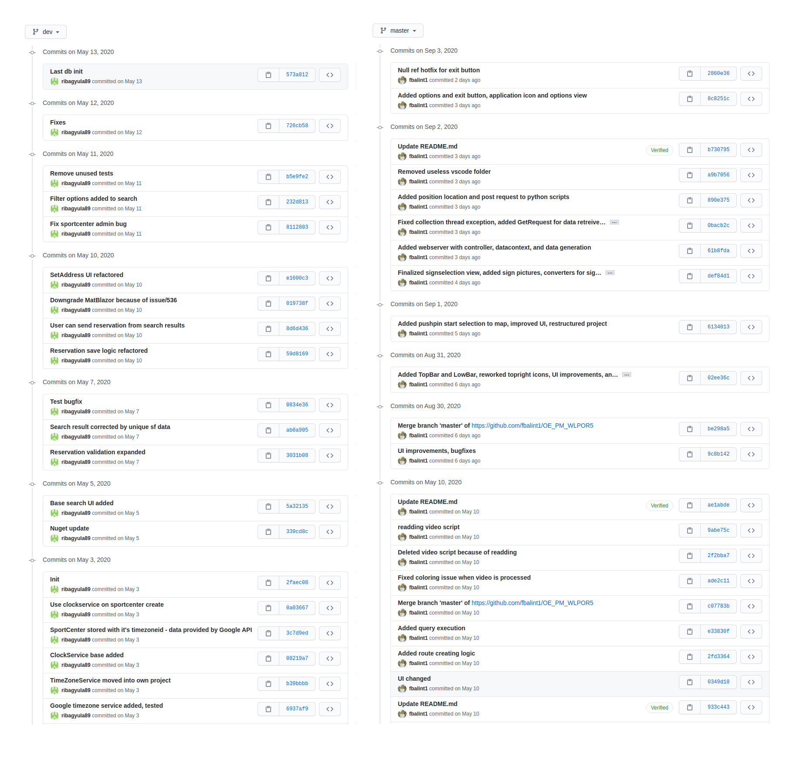

# Szakdolgozat II. Tájékoztató Dokumentum

.\
.

### Figyelem! Jelen útmutató illetve követelményleírás csak Sipos Miklós szakdolgozói számára vonatkozik.

.\
.

Jelen dokumentum keretein belül szeretném összefoglalni a `Szakdolgozat II. tárgy menetrendjét, követelményeit és elvárásait`. Kérnék mindenkit, hogy figyelmesen olvassa át és a félévben az itt leírtaknak megfelelően járjon el.

## 1.) Félévi mérföldkövek
  - **MK 0.:** 01. hét » repository létrehozása (lásd lentebbi "repository létrehozása" rész)
  - **MK 1.:** 03. hét » fejlesztés erőteljesen kell, hogy menjen már 3 hete
  - **MK 2.:** 06. hét » minimálisan működő rendszert már kell látni ezen a ponton
  - **MK 3.:** 10. hét » a fejlesztéssel nagyjából készen kell lenni, a legtöbb funkciónak működnie kell; a 11. héten már a tesztelésre kell rátérni
  - **MK 4.:** 12. hét » fejlesztés és tesztelés kész, dokumentálás végső simításait kell elvégezni

Adott hét `vasárnapjának 23:59 percéig` szeretném email formájában megkapni a szakdoga aktuális (és az előzőhöz képest előrehaladottabb) változatát. Az emailben vázlatpontokban szívesen venném, ha fel lenne tüntetve, hogy mi került bele pluszként az előzőhöz képest. Ha a doksiban esetleg sárga háttérrel megjelölitek az is teljesen rendben van. A lényeg az lenne, hogy átnézve könnyen lássam egyből mi az inkrementum. Ha a dokumentum nem módosult -- ami a fejlesztés szakaszban előfordulhat -- akkor "új" verziót nem szükséges küldeni, ez esetben viszont kérném, hogy a küldött emailben felsorolás-szerűen (!) legyen ott, hogy mivel haladtatok / mi van még hátra / milyen problémák merültek fel.

Küldéskor pdf verziót küldjetek.\
A küldött dokumentum neve ez legyen: `SZD1_MK[#]_[NEPTUN]_[TELJES-NÉV].pdf`

A küldött email **tárgya** ez legyen: `SZD1_MK[#]_[NEPTUN]_[TELJES-NÉV]`

Ha valaki nem halad egyik mérföldkőről a másikra, akkor ilyen egyetlen alkalommal fordulhat elő. Ha egynél többször fordul elő, akkor a szakdoga2-őt nem fogom aláírni félév végén. Ennek oka, hogy a félév utolsó hetében nem szeretnék senkinél/vel tüzet oltani, és lutrira sem fogok senkit átengedni. Legyen benne a munka és akkor nem lesz gond - mondanom sem kell, ez egyben a Ti érdeketek is!

Kivételt képez ez alól, ha szól előre az illető, hogy nagy a gáz / kiégtem idegileg a sok zh-tól / családi gond van / stb. Ez esetben az illetővel majd egyeztetek, hogy a mérföldkövet hova csúsztassuk.

A mérföldkövek után mindenkinek visszajelzek a leadott munkával kapcsolatban.

## 1.1.) Repository létrehozása
A repository létrehozásának a következő a menete:
1. a repót magát én fogom létrehozni a GitLab-on, a megfelelő group-on belül
1. küldjetek egy emailt nekem, hogy milyen email címre küldhetem a meghívást
1. lehet előre is regisztrálni ehhez, de pl. Google account-tal (gmail-es cím) 1 klikkel be lehet loginolni (így én ezt javasolnám)
1. vagy ha van korábbról GitLab account, az is teljesen jó

Ha valaki korábbi **projektmunkázó** hallgató, akkor a már meglévő repóját fogom átmigrálni a projektmunkázó csoportból a szakdolgozó csoportba.

A repót természetesen rendeltetésszerűen használjátok, tehát nem a félév végén akarok látni 1 db commit + push kombinációt, hanem szépen a munka előrehaladását, hétről hétre lehetőleg. Erről egy elvárt commit history itt alább látható.

## 2.) Javasolt fejezetcímek

*Folytatva, a szakdolgozat I-ben abbahagyott sorszámozást.*

7. **`Fejlesztés`** (~ 10 oldal)
    - itt majdhogynem fejlesztési naplóként nyugodtan le lehet írni a dolgokat, annyi megkötéssel/javaslattal, hogy:
    - minden apró-cseprő dolgot ne írjatok bele, törekedjetek a fontos dolgokat kiemelni; mindenképpen ilyen egy-egy probléma amibe belefutottatok, ami kapcsán aztán hoztatok egy döntést (ugye egy mérnök sok szívással szembesül, azok közül mérlegel, döntést hoz és halad tovább >> ezt volna jó viszont olvasni a dolgozatban is)
8. **`Tesztelés`** (~ 5 oldal)
    - elengedhetetlen része a szd-nak; enélkül nem fogom elfogadni a szd2-őt senkinek (hovatovább, záróvizsgán is sanszos ez)
    - a lényeg, hogy meggyőződjünk arról, hogy amit csináltunk az jó-e / működik-e (Dr. Tick József tanár úr validáció és verifikáció diáit javaslom előkapni)
    - kicsit nézzetek utána, hogy milyen tesztek vannak (ezeket egyébként utólagosan az ir.kut-ba is nyugodtan bele lehet tenni)
      - amit sw fejlsztés esetén mindig elő lehet kapni: unit teszt, manuális teszt, funkcionális teszt >> ezekhez többé kevésbé vannak dedikált tool-ok / keretrendszerek, nézzetek utána és válasszatok (a döntési folyamatot itt is lehet dokumentálni)
9. **`Értékelés`** (2 oldal)
    - „miután lefejlesztettem amit kértek tőlem
    - és leteszteltem, hogy azt csinálja-e amit kértek tőlem
    - értékelem, hogy az elvárásokhoz képest mit tud / nem tud / miben tud többet”
10. **`Továbbfejlesztési lehetőségek`** (1 oldal)
    - milyen potenciális dolgokat látsz benne még, amire nem jutott idő / energia , de nagyon jó lenne ha még benne lenne
    - az ötletek megalapozottak legyenek, ne légbőlkapottak
11. **`Összegzés`** (3/4 oldal)
    - rövid összefoglalás a dolgozatról, eredmények bemutatása
    - nagyon hasonló, mint az absztrakt, sok esetben vele megegyezik (viszont akinél megegyezik ott javasolt csak az egyiket megtartani)
    - attól függően, hogy absztrakt vagy befejezés van, kell egy magyar és egy angol verzió is (ha van mind a kettő, akkor az absztrakt legyen a magyar, és utána egy 'abstract' ami angol, a befejezés meg sima magyar)
12. **`Irodalomjegyzék`**
13. **`Ábrajegyzék`**
14. **`Táblajegyzék`** (ha van)
15. **`Mellékletek`** (ha van)
    - aki olyan rendszert csinált ami online, ott javasolt mellékletekben megadni, hogy hol és hogyan érhető el a rendszer, milyen login adatokkal stb.
    - akinél nem ilyen dologról van szó, ott pedig leírni azokat a lépéseket ahogy a rendszert be lehet üzemelni
    - a kész rendszerről képeket, funkciók bemutatását képekkel is ide kell elhelyezni és röviden leírni, hogy mit látunk 

## 3.) Konzultációs napló
Ezt majd félév végén egyben letudjuk, én fogom kiállítani, ha mindent rendben volt a félévben. A lényege, hogy azok a mérföldkövek hivatalosan dokumentálva legyenek, amelyeket a félév folyamán érintettünk.

## 4.) CD melléklet
A szakdolgozattal le kell adni majd CD mellékletet is, ezen el kell helyezni sok-sok-sok mindent (erről Susik Márta ír majd tájékoztató mailt nektek). Amit ezek közül kiemelnék azok a forrásfájlok lesznek; olyat töltsetek fel, amiből reprodukálható az amit leírtatok és megcsináltatok; tehát orbitális kamuk ne legyenek. Továbbá, a CD-re fel kell rakni a konz. napló szkennelt változatát is. Itt problémás lehet, hogy én csak a kész dolgozatban írom már ezt alá. Ez esetben semmi gond, ha telóval befotózzátok miután aláírtam és azt írjátok a CD-re az is teljesen megfelelő (nem szükséges ezért szétszedni a már lekötött anyagot).

## 5.) Leadás menete (félév vége)
  - Megírjátok a dolgozatot.
  - A félév végén ha minden ok, elfogadom.
  - Átadom a konz. naplót (nem aláírva).
  - A konz. naplóval együtt (+ még sok dolog, amiket Susik Márta ír meg nektek) elmentek kinyomtatni és leköttetni.
  - A lekötött szakdogát visszahozzátok nekem és az utolsó lépés, hogy a konz. naplót aláírom a már bekötött szakdogában.
  - Utána mehettek leadni Susik Márta irodájába, aminek a határideje emlékeim szerint mindig: 14. szorgalmi hét szerda 15:00-ig bezárólag. Tehát én azt javasolnám, hogy 13. szorgalmi hét végére már 100%-os legyen a munka, hétfőn / kedden nyomtatás és köttetés, szerda leadás. (Megj.: nem tudom, hogy van-e ilyen +1 hét határidő díj ellenében, de nem is szeretnék ezzel foglalkozni; tartsuk magunkat a menetrendhez.)

## 6.) Szakdolgozat köttetés
  - Köttetésnél én a CopyGuru-t javaslom, van egy a Jászai Mari tér környékén, szép munkát csinálnak.
  - Mivel mindenki ilyenkor megy, ezért úgy dolgoznak, hogy 1 nap átfutás van (általában minden helyen 1-2 nap); de van SOS köttetés ami feláras, de akkor instant megcsinálják. 

## 7.) Védés
Szakdolgozat II-ből nincsen olyan védés, mint szd1 esetén, viszont hivatalosan a szakdoga2 leadását követné a záróvizsga, ahol hasonlóan, mint szd1 esetén meg kell védeni és elő kell adni a dolgozatot amin dolgoztál. Természetesen a záróvizsga ideje csúszhat, ha te nem éppen akkor végzel. A védéshez szükséges szintén egy prezentáció, csak úgy mint szd1 esetén, erről mindenkivel egyeztetek majd ha ott tartunk.

  

Bármilyen kérdés esetén keressetek bizalommal.

---

**Sipos Miklós**\
Tanszéki Mérnök\
Óbudai Egyetem Neumann János Informatikai Kar\
Szoftvertervezés és -fejlesztés Intézet\
sipos.miklos@nik.uni-obuda.hu\
https://users.nik.uni-obuda.hu/siposm/