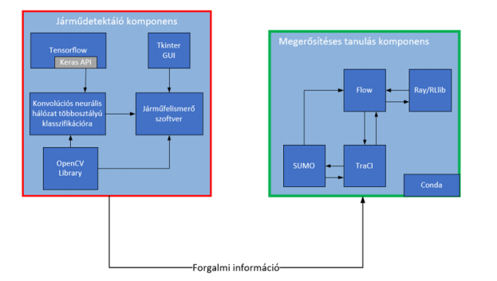
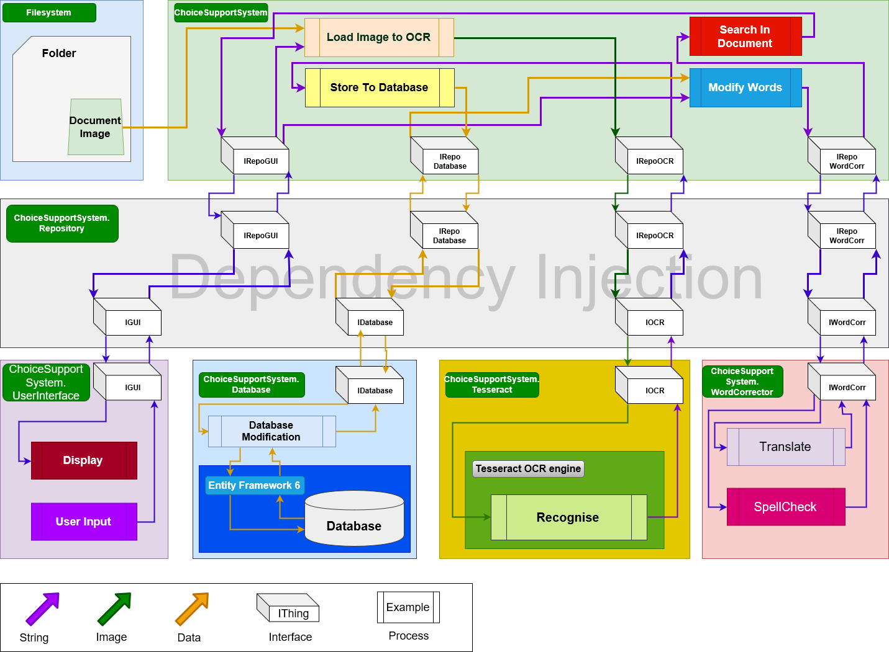
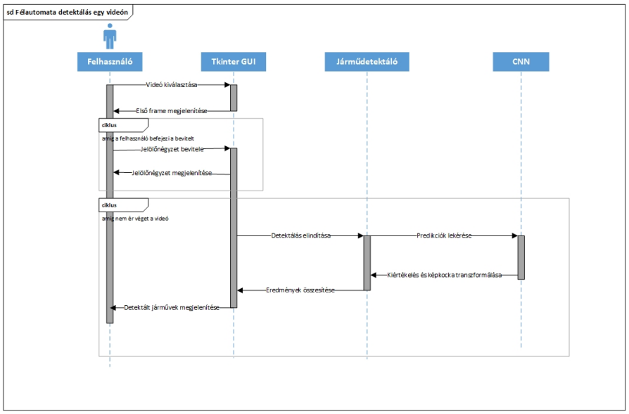
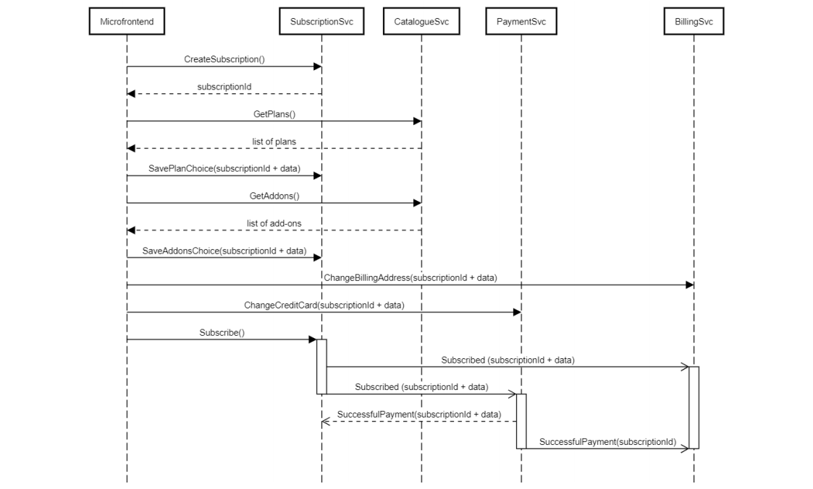
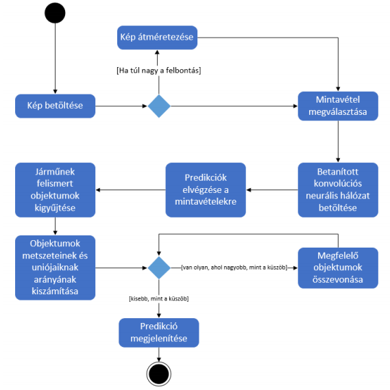
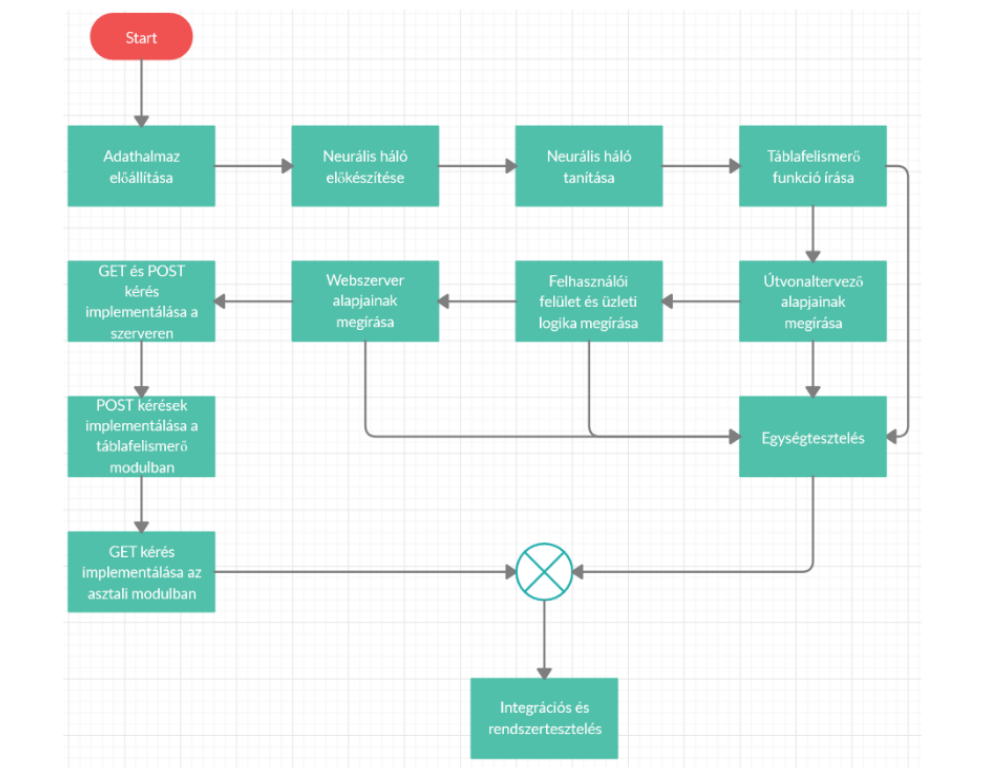
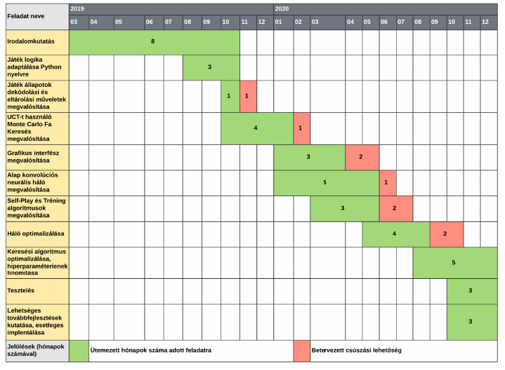

# Tervezés

A tervezés fejezet lényege, hogy be tudd mutatni azt, hogy a tanulmányaid ezen szakaszára eljutottál oda, hogy meg tudsz tervezni egy rendszert látatlanban. Nem baj és nem is biztos, hogy tökéletes lesz és nem kell semmit változtatni rajta, a lényeg, hogy tudj tervezni. Persze, törekedni kell arra, hogy amit megtervezel az a legkisebb mértékben legyen majd módosítva a megvalósítás folyamán -- de természetesen ilyen (hogy módosítani kell valamit) előfordulhat.

A tervezés fejezetben mindenképpen jelenjenek meg konkrét ábrák a különböző tervezési módszerek reprezentálására.

### Szekvencia diagram
Érdemes a rendszer fő egységét, vagy a rendszer egészét, vagy a rendszer legfontosabb és legkomplexebb részét (ez feladattól függ) bemutatni egy szekvenciadiagram segítségével, amely a megértést elősegíti, hiszen az egyes lépések illetve azok egymásutánisági tökéletesen látható erről.

### Folyamatábra
Szintén vannak bizonyos folyamatok, amelyek nagyon jól szemléltethetők folyamatábra segítségével. Akár a rendszer teljes egészét, akár egy bizonyos kiemelendő részét érdemes így bemutatni.

### Teljes rendszer terve
Fontos, hogy megjelenjen egy high-level terv arról, amit szeretnél készíteni. Ez azért kell, mert máskülönben nem lesz "kézzel fogható" kimenete a tervezésnek. Itt nagyjából rád van bízva, hogy mennyire szeretnél részletes tervet készíteni, de mindenképpen tükröződnie kell a főbb moduloknak a tervből.

### Fejlesztés tervezett menete
Szintén érdemes meghatározni egy agenda-szerűséget, hogy pontosan melyik komponensek fejlesztése élvez prioritást, valamint, hogy pontosan mi lesz a fejlesztésnek az általános üteme. Ezt lehet akár folyamatábrával vagy pedig Gantt-diagrammal is ábrázolni. Minden esetben jelenjen meg a tesztelés is, valamint erősen javasolt csúszási időtartalékkal is számolni.

---

## Példák
Az alább látható példák kész szakdolgozatokból vagy TDK dolgozatokból származnak, melyek felhasználhatóságát ezúton is köszönök hallgatóimnak.

### Rendszertervek
#### Csuzdi Bence & Seres Richárd

#### Kaló Áron

#### Kaló Áron

#### Falus Dániel

### Szekvencia diagramok
#### Csuzdi Bence

#### Falus Dániel

#### Félix Bálint

### Folyamatábrák
#### Csuzdi Bence

#### Falus Dániel

### Fejlesztés tervezett menete
#### Félix Bálint

#### Róth Bence

#### Béres Mátyás
