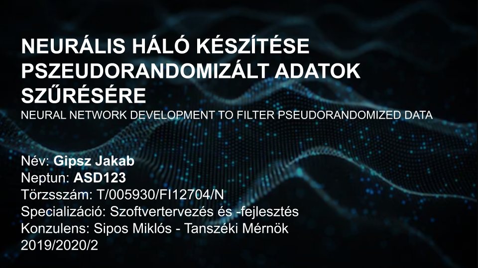

# Prezentáció

- 10 perces előadással készüljetek ( a 10 percet **nagyon** komolyan vegyétek )
- a tartalom tükrözze a féléves munkátokat
    - mivel eddig kb. csak irodalomkutatás van, leginkább egy "fejtágító" dologról lesz szó
    - DE már van rendszerterv, specifikáció, stb. azokat nyugodtan lehet bele pakolni
    - akiknek van munka projektmunkáról ott természetesen az is legyen benne mint már fejlesztés alatt álló rendszer, esetleg rövid bemutatóval, hogy mit tud jelenleg. (bemutató esetén javaslom .gif készítését, mivel a ppt-ben vetítés közben az fixen és jól működik. Videóval lehetnek gondok)
    - tehát a fő lényeg, hogy a saját munkáról beszéljetek (mit csináltál, miért csináltad, hogyan csináltad) ne pedig arról, hogy a 128. keretrendszerben melyik függvényt hívnád meg
- diaszám így konkrétan nincsen, de főbb fejezeteknek érdemes a szakdoga fejezeteit választani
- az előadást feltétlen gyakoroljátok át párszor, legyen egy gondolatmenet a fejedben, hogy mi alapján akarod végigmondani az egészet
- ami mindenképpen legyen a diában:
    - a diák legyenek oldalszámozva és legyen ott, hogy hányadik oldal a mennyiből (pl. 3/20)
    - borító slide (minta kép lentebb)
        - teljes neved
        - neptunkódod
        - konzulensed neve
        - dátum
        - témád címe magyarul és angolul
        - specializációd megnevezése
- amit érdemes kerülni:
    - hatalmas fejezetek rámásolva folyószövegként a diára
        - nincs idő elolvasnia senkinek
        - elveszi a figyelmet rólad mint előadóról és arról amit mondasz

# Minta borító

